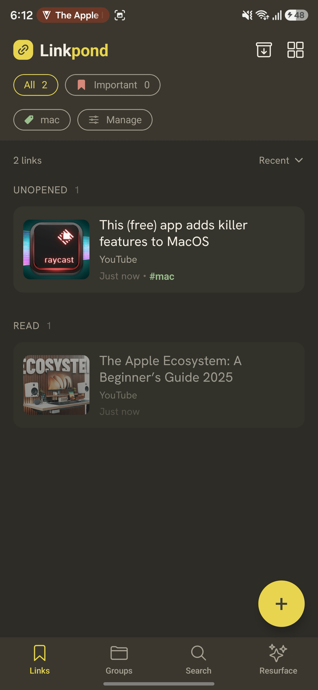
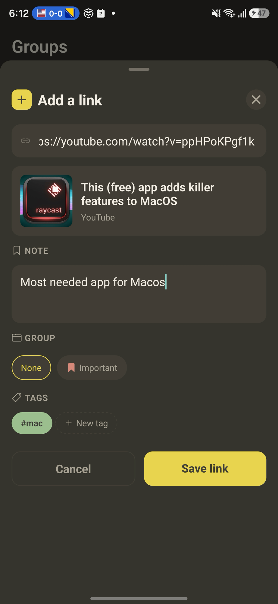
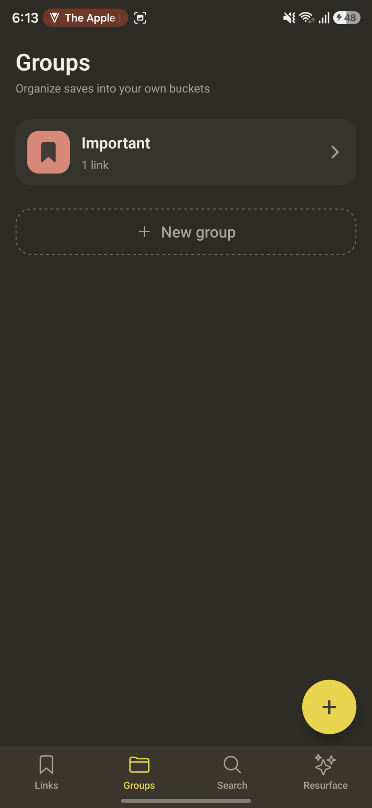
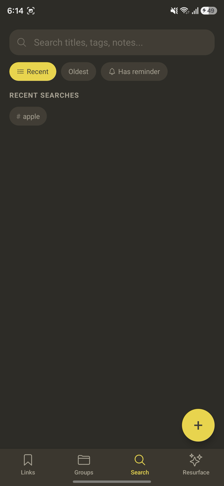
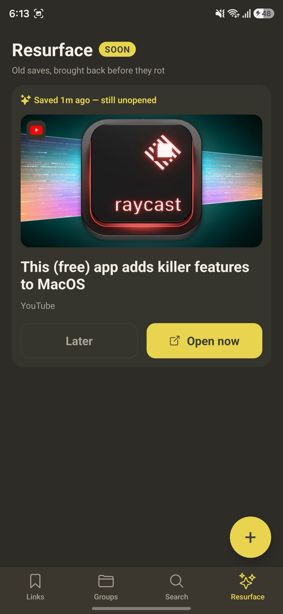
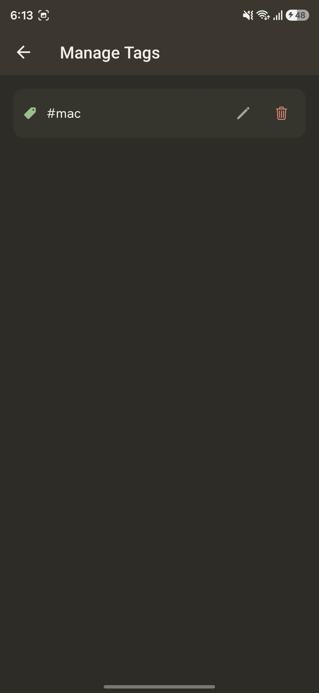

<div align="center">

# 🔗 Linkpond

**A local-first link manager for Android — save anything, find it later.**

Save links from anywhere, get rich previews, organize with groups & tags, set reminders,
and search it all — fully offline, no account, no backend.

[](https://docs.expo.dev/versions/v56.0.0/)
[](https://reactnative.dev/)
[](https://www.typescriptlang.org/)
[-9DBE8E)](#)

[Download the APK »](https://github.com/prasish07/linkpond/releases/latest)

</div>

---

## What it does

Linkpond is a place to **pond** the links you'd otherwise lose in a dozen chat threads and open tabs.

- 🔗 **Save from anywhere** — paste a URL, or share straight into the app from another app
- 🖼️ **Rich previews** — title, site, and thumbnail auto-fetched, with a graceful fallback when a site (Instagram / Facebook / X) blocks unauthenticated previews
- 📁 **Groups** — organize links into user-created groups, each with its own icon and color
- 🏷️ **Tags** — freely tag links; create, apply, **rename and delete** tags inline or from a dedicated Manage Tags screen
- 🔍 **Search, sort & filter** — by keyword, group, tag, or "has reminder"; recent searches remembered
- ⏰ **Reminders** — nudge yourself to actually revisit a saved link
- 🗄️ **Archive** — tuck away links you're done with, without deleting them
- ♻️ **Resurfacing** *(v2)* — spaced resurfacing of older, unopened links so good saves don't rot

Everything lives in an on-device SQLite database — **it works with no connection and no sign-in.**

## Screenshots

| Links | Add a link | Groups |
|:---:|:---:|:---:|
|  |  |  |

| Search | Resurface *(v2)* | Manage Tags |
|:---:|:---:|:---:|
|  |  |  |

## Tech stack

| Area | Choice |
|---|---|
| Framework | **Expo SDK 56** (React Native 0.85, React 19) |
| Language | **TypeScript** |
| Navigation | **Expo Router** (file-based) |
| Data | **expo-sqlite** (local-first, 5-table schema) + **@tanstack/react-query** |
| UI / motion | **@gorhom/bottom-sheet**, **react-native-reanimated**, **react-native-gesture-handler** |
| Type / theme | Hanken Grotesk via `expo-font`; centralized design tokens in `src/theme/theme.ts` |

## Getting started

```bash
# install
npm install

# run in Expo Go (fast iteration for UI/JS work)
npx expo start --go     # then scan the QR on an Android device
```

> **Native features** (share-to-save intents) need a dev build, not Expo Go — see
> [`docs/07-running-on-mac-troubleshooting.md`](docs/07-running-on-mac-troubleshooting.md).

### Build a release APK locally

```bash
brew install openjdk@17          # one-time (see docs/07 for why)
npm run release                  # builds the APK and publishes a GitHub Release
```

Or grab a prebuilt one from the [Releases page](https://github.com/prasish07/linkpond/releases/latest).

## Project structure

```
app/                     # Expo Router screens (tabs, add, edit, link detail, tags/manage…)
src/
  components/            # shared UI (Touchable, ActionSheet, TagPicker, Toast…)
  features/              # feature modules (links, groups, tags) — hooks + data layer
  db/                    # SQLite client + schema init
  lib/                   # helpers (preview fetch, canonicalize URL, notifications…)
  theme/                 # design tokens (colors, spacing, typography)
docs/                    # architecture, roadmap, design brief, troubleshooting
scripts/release.sh       # one-command release (build APK + GitHub Release)
```

## Roadmap

Phases 0–9 are **shipped** (data layer, previews, groups, tags, search/sort, reminders,
archive, share intent, and a full visual polish pass). **Phase 10** — the spaced-resurfacing
engine — is next. See [`docs/03-build-roadmap.md`](docs/03-build-roadmap.md).

## About

Linkpond is a portfolio project built to learn React Native properly by shipping a real,
polished, local-first app. Architecture and schema live in
[`docs/linkpond-mvp.md`](docs/linkpond-mvp.md); design tokens in
[`docs/05-design-brief.md`](docs/05-design-brief.md).
